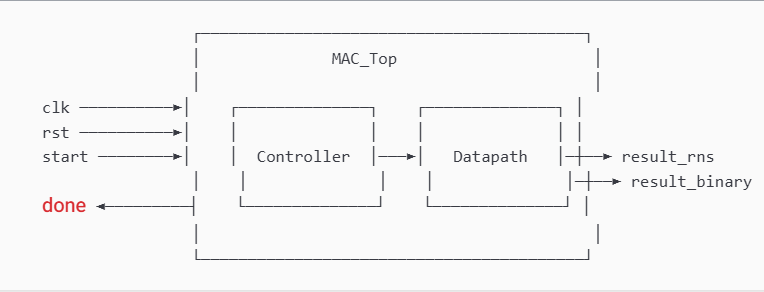
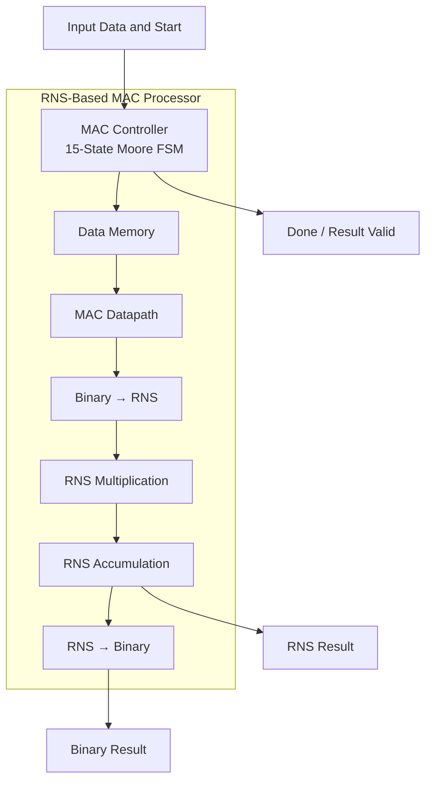
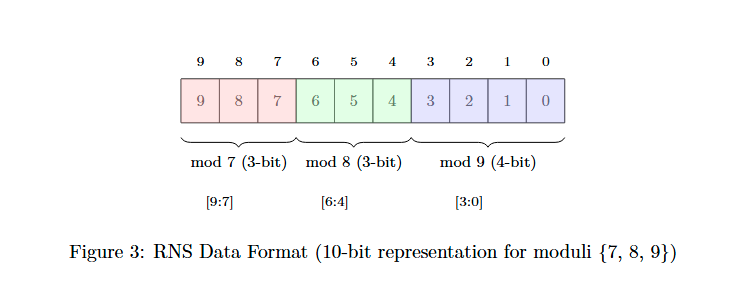
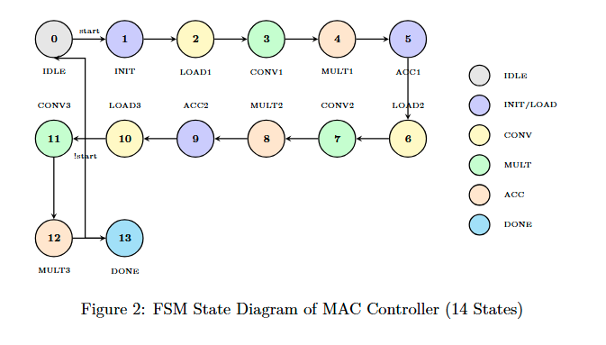
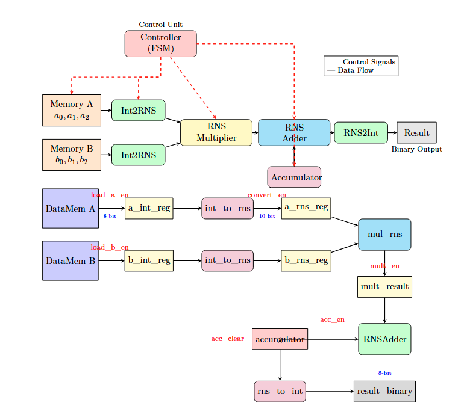
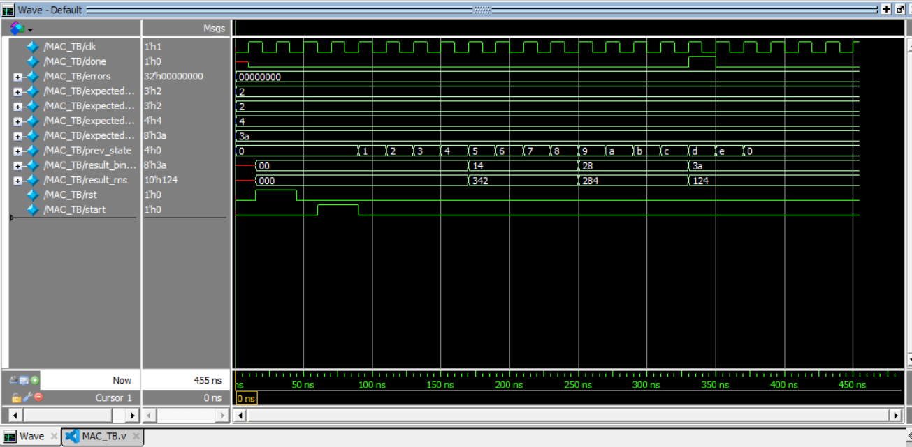
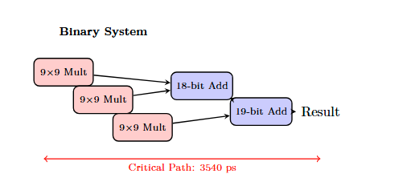
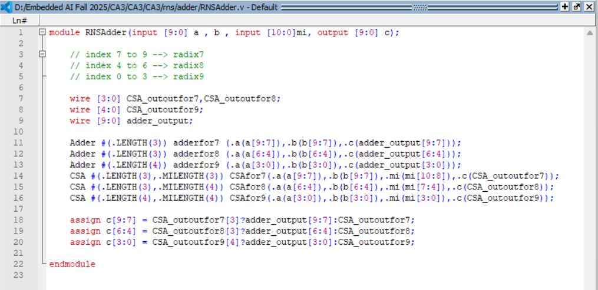
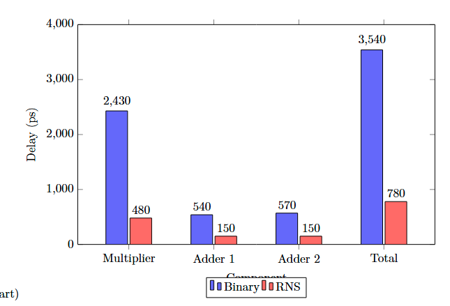

<div align="center">
  
</div>

---

# RNS-Based Multiply-Accumulate (MAC) Unit with Verilog

This project implements and verifies a hardware **Multiply-Accumulate (MAC) unit based on the Residue Number System (RNS)** using the moduli set `{7, 8, 9}`. The design integrates a Moore FSM controller, an RNS datapath, modular arithmetic units, binary-to-RNS and RNS-to-binary conversion, and a ModelSim testbench, followed by a comparative analysis of **delay and hardware area against a conventional Binary MAC architecture**.

<div align="left">

[](https://en.wikipedia.org/wiki/Verilog)
[](https://eda.sw.siemens.com/en-US/ic/modelsim/)
[](#)
[](#)
[](#)
[](https://eda.sw.siemens.com/en-US/ic/modelsim/)
[](https://opensource.org/licenses/MIT)

</div>

## Abstract

The project explores the implementation of a **Multiply-Accumulate unit in the Residue Number System** with the moduli `{7, 8, 9}`. The architecture separates control and computation into a 15-state Moore finite-state machine and a dedicated datapath.

The datapath performs binary-to-RNS conversion, residue-domain multiplication, modular accumulation, and final RNS-to-binary reconstruction. Because the residue channels operate independently, arithmetic can be performed in parallel without global carry propagation between channels.

For the implemented test case:

```math
(5\times4)+(10\times2)+(3\times6)=58
```

and the final RNS representation is:

```math
58 \rightarrow (2,2,4)_{(7,8,9)}
```

The project also evaluates the estimated critical-path delay and hardware area. The RNS MAC achieves an estimated **780 ps delay and 104 GE area**, compared with **3540 ps and 253 GE** for the Binary MAC model used in the analysis.

## Table of Contents

1. [Overview](#overview)
2. [Key Features](#key-features)
3. [System Architecture](#system-architecture)
4. [RNS Data Representation](#rns-data-representation)
5. [MAC Controller and Datapath](#mac-controller-and-datapath)
6. [Verification and Simulation](#verification-and-simulation)
7. [Binary vs. RNS Analysis](#binary-vs-rns-analysis)
8. [Performance Summary](#performance-summary)
9. [Project Structure](#project-structure)
10. [Simulation](#simulation)
11. [License](#license)
12. [Author](#author)

---

# Overview

The MAC operation implemented by the design is:

```math
MAC=\sum_{i=0}^{2}A_iB_i
```

For the provided test data:

| Operand | Value |
| ------- | ----: |
| \(A_0\) |     5 |
| \(B_0\) |     4 |
| \(A_1\) |    10 |
| \(B_1\) |     2 |
| \(A_2\) |     3 |
| \(B_2\) |     6 |

Therefore:

```math
MAC=(5\times4)+(10\times2)+(3\times6)=58
```

The selected moduli provide a dynamic range of:

```math
M=7\times8\times9=504
```

which is sufficient for the represented values.

---

# Key Features

* RNS-based Multiply-Accumulate architecture
* Moduli set `{7, 8, 9}`
* 10-bit packed RNS representation
* 15-state Moore FSM controller
* Dedicated MAC datapath
* Binary-to-RNS conversion
* Parallel residue-domain multiplication
* Modular RNS accumulation
* RNS-to-binary reconstruction
* ModelSim functional verification
* Automated result checking in the testbench
* Waveform-based verification
* Binary vs. RNS delay analysis
* Binary vs. RNS hardware-area estimation

---

# System Architecture

The design consists of a controller, datapath, memory interface, RNS arithmetic modules, and result reconstruction.

<p align="center">
  
</p>

The top-level architecture separates **control flow** from **arithmetic execution**:



---

# RNS Data Representation

Each integer is represented by its residues with respect to the three selected moduli:

```math
X\rightarrow(X\bmod7,\;X\bmod8,\;X\bmod9)
```

The implementation stores the three residues in a **10-bit vector**:

```text
┌───────────┬───────────┬──────────────┐
│  mod 7    │  mod 8    │    mod 9     │
│  [9:7]    │  [6:4]    │    [3:0]     │
│  3 bits   │  3 bits   │   4 bits     │
└───────────┴───────────┴──────────────┘
```

<p align="center">
  
</p>

For the final result:

```math
58\bmod7=2
```

```math
58\bmod8=2
```

```math
58\bmod9=4
```

so:

```math
58\rightarrow(2,2,4)
```

---

# MAC Controller and Datapath

## Controller

The control unit is implemented as a **15-state Moore FSM**. It coordinates initialization, operand loading, conversion, multiplication, accumulation, and final result generation.

<p align="center">
  
</p>

The execution sequence is conceptually:

```text
IDLE
  ↓
INIT
  ↓
LOAD₁ → CONVERT₁ → MULTIPLY₁ → ACCUMULATE₁
  ↓
LOAD₂ → CONVERT₂ → MULTIPLY₂ → ACCUMULATE₂
  ↓
LOAD₃ → CONVERT₃ → MULTIPLY₃ → ACCUMULATE₃
  ↓
DONE
```

## Datapath

The datapath performs the actual arithmetic operations under the control of the FSM.

<p align="center">
  
</p>

Its main stages are:

| Stage          | Function                                             |
| -------------- | ---------------------------------------------------- |
| Data Memory    | Supplies the input operand pairs                     |
| Binary-to-RNS  | Converts binary operands into residue representation |
| RNS Multiplier | Performs independent multiplication for each modulus |
| RNS Adder      | Accumulates products in the residue domain           |
| RNS-to-Binary  | Reconstructs the final binary result                 |

---

# Verification and Simulation

The project includes a dedicated `MAC_TB.v` testbench for functional verification in ModelSim.

The testbench checks both the final RNS result and its reconstructed binary value.

## Test Case

```text
Moduli: {7, 8, 9}

a[0] = 5    b[0] = 4
a[1] = 10   b[1] = 2
a[2] = 3    b[2] = 6

Expected MAC Result = 58
Expected RNS        = (2, 2, 4)
```

The resulting packed RNS value is:

```text
0100100100
```

with:

```text
Bits [9:7] → mod 7 = 2
Bits [6:4] → mod 8 = 2
Bits [3:0] → mod 9 = 4
```

The testbench reports:

```text
[PASS] mod 7: Got 2, Expected 2
[PASS] mod 8: Got 2, Expected 2
[PASS] mod 9: Got 4, Expected 4
[PASS] Binary: Got 58, Expected 58

ALL TESTS PASSED
```

## ModelSim Waveform

<p align="center">
  
</p>

The waveform demonstrates the interaction between the clock, reset, start signal, FSM state transitions, RNS result, binary result, and completion signal.

---

# Binary vs. RNS Analysis

The project compares the RNS implementation with a conventional Binary MAC architecture using the analytical delay and area models defined in the accompanying report.

## Delay

For the Binary MAC, the critical path contains one multiplication followed by two serial additions:

```math
T_{Binary}=2430+540+570=3540\;ps
```

For the RNS MAC, the three residue channels operate in parallel, so the critical path is determined by the slowest channel:

```math
T_{RNS}=480+150+150=780\;ps
```

<p align="center">
  
</p>

This gives an estimated delay improvement of:

```math
\frac{3540}{780}\approx4.54\times
```

## Hardware Area

The estimated hardware area is expressed in Gate Equivalents (GE).

| Architecture | Multiplier Area | Adder Area | Total MAC Area |
| ------------ | --------------: | ---------: | -------------: |
| Binary       |          216 GE |      37 GE |         253 GE |
| RNS          |           72 GE |      32 GE |         104 GE |

<p align="center">
  
</p>

The resulting total-area ratio is:

```math
\frac{253}{104}\approx2.43\times
```

---

# Performance Summary

| Metric               |  Binary | RNS `{7,8,9}` | RNS Advantage |
| -------------------- | ------: | ------------: | ------------: |
| Multiplication Delay | 2430 ps |        480 ps |  5.06× faster |
| Addition Delay       |  540 ps |        150 ps |  3.60× faster |
| Total MAC Delay      | 3540 ps |        780 ps |  4.54× faster |
| Multiplier Area      |  216 GE |         72 GE | 3.00× smaller |
| Adder Area           |   37 GE |         32 GE | 1.16× smaller |
| Total MAC Area       |  253 GE |        104 GE | 2.43× smaller |

<p align="center">
  
</p>

The main architectural advantage of the RNS implementation comes from **independent parallel residue channels**, reduced arithmetic width, and the absence of global carry propagation between channels.

---

# Project Structure

```text
RNS-Based-MAC-Unit-with-Verilog/
│
├── design/
│   ├── DataMem.v
│   ├── rns/
│   │   ├── adder/
│   │   ├── int_to_rns/
│   │   ├── mult/
│   │   └── rns_to_int/
│   ├── mac_unit/
│   └── unsigned integer/
│
├── src/
│   ├── MAC_Controller.v
│   ├── MAC_Datapath.v
│   ├── MAC_TB.v
│   ├── MAC_Top.v
│   ├── DataMem.txt
│   └── mac_waveform.vcd
│
├── assets/
│   ├── system-architecture.png
│   ├── mac-controller-fsm.png
│   ├── mac-datapath.png
│   ├── rns-data-format.png
│   ├── modelsim-waveform.png
│   ├── delay-comparison.png
│   ├── area-comparison.png
│   └── rns-vs-binary-summary.png
│
├── RNS-Based-MAC-Design-and-Performance-Analysis.docx
├── RNS-Based-MAC-Design-and-Performance-Analysis.pdf
├── RNS-Based-MAC-Project-Specification.pdf
├── MAC_Controller.v
├── MAC_Datapath.v
├── MAC_TB.v
├── MAC_Top.v
├── DataMem.txt
└── README.md
```

Generated ModelSim files such as compiled libraries and temporary simulation artifacts are intentionally omitted from the documented source structure.

---

# Simulation

The design can be compiled and simulated using ModelSim.

The main verification entry point is:

```text
MAC_TB
```

The main top-level design is:

```text
MAC_Top
```

After compilation, run the testbench and inspect the transcript and waveform to verify:

* FSM state transitions
* Operand loading
* Binary-to-RNS conversion
* RNS multiplication
* RNS accumulation
* Final RNS result
* Binary result reconstruction
* `done` / result-valid behavior

---

# License

This project is licensed under the MIT License.

---

## Author

**Farzad Jannati**

M.Sc. Student, University of Tehran
Research Assistant @ Social Networks Lab

**Research Interests:** NLP, Large Language Models (LLMs), Agentic AI, Retrieval-Augmented Generation (RAG), Information Retrieval

[GitHub](https://github.com/farzadjannati) | [LinkedIn](https://www.linkedin.com/in/farzadjannati)

---

<p align="center">
  Designed and implemented with Verilog for RNS-based digital arithmetic and MAC acceleration.
</p>
